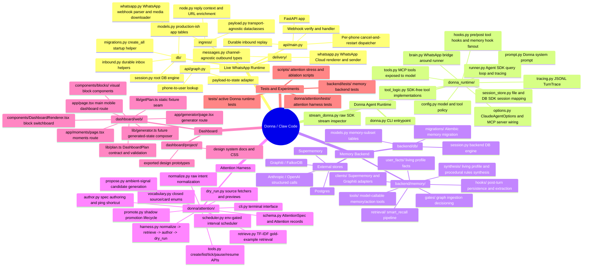
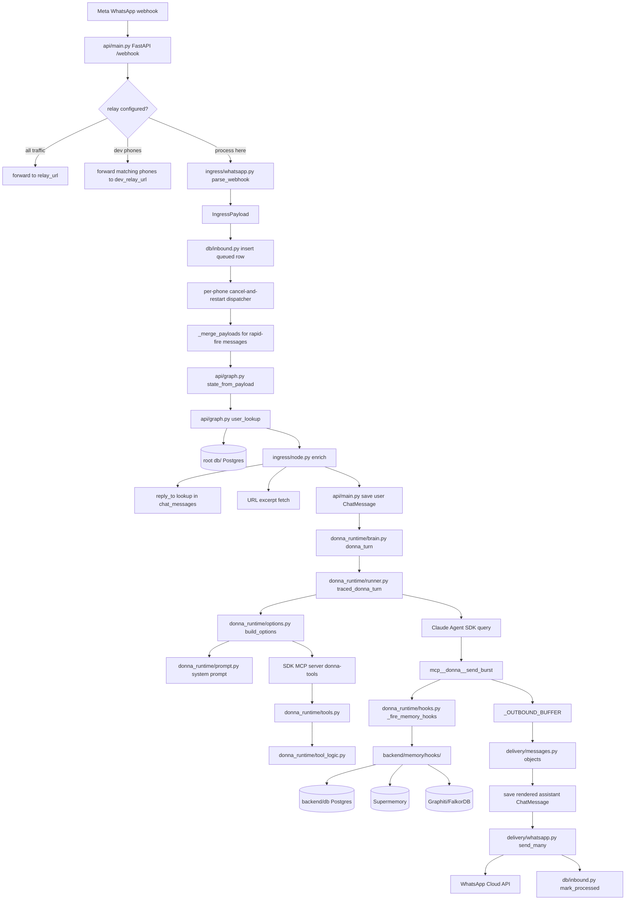
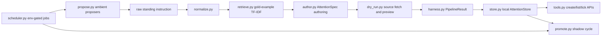
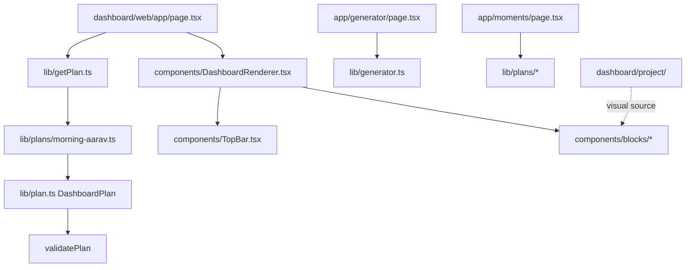

# Codebase Mind Map

Generated from the current repo state on 2026-04-22.

## High-Level Map

## Primary Live Runtime Flow

This is the current user-message path for WhatsApp traffic.

## Runtime Components

| Area | Where | Role | Main inbound deps | Main outbound deps |
|---|---|---|---|---|
| FastAPI webhook | `api/main.py` | Receives WA webhook, durable inbox insert, dispatch coordination, DB persistence, delivery | `ingress/`, `api/graph.py`, `db/` | `donna_runtime.brain`, `delivery.whatsapp` |
| State adapter | `api/graph.py` | Converts `IngressPayload` to flat state and resolves phone to user | `ingress.payload`, root `db/` | state dict consumed by enrichment/brain |
| Ingress adapter | `ingress/whatsapp.py` | Parses WA payloads, dedups, downloads media, normalizes message types | Meta webhook JSON, `config.py` | `IngressPayload` |
| Ingress enrichment | `ingress/node.py` | Adds reply context and URL excerpts | root `db.ChatMessage`, HTTP URLs | enriched state |
| Delivery model | `delivery/messages.py` | Channel-independent outbound dataclasses | `donna_runtime.tool_logic` | channel renderers |
| WhatsApp delivery | `delivery/whatsapp.py` | Renders outbound objects to WA Cloud API JSON and sends sequentially | `delivery.messages`, `config.py` | Meta Graph API |
| Donna CLI | `donna.py` | Local CLI for running, auditing, health, LangSmith smoke tests | `donna_runtime/*` | Agent SDK runner |
| Brain bridge | `donna_runtime/brain.py` | Wraps the SDK turn for the WhatsApp pipeline and captures `send_burst` output | state dict, session store, runner | `_outbound`, `_turn_trace` |
| SDK runner | `donna_runtime/runner.py` | Executes `claude_agent_sdk.query`, records trace, persists session ids | `options.py`, `hooks.py`, `tracing.py` | `TurnTrace`, optional WA delivery |
| SDK options | `donna_runtime/options.py` | Builds `ClaudeAgentOptions`, MCP server, tool policy, hooks | `config.py`, `prompt.py`, tool lists | Claude Agent SDK |
| Model tools | `donna_runtime/tools.py` | MCP tool wrappers seen by the model | current trace/user context | backend memory tools, outbound buffer |
| Tool logic | `donna_runtime/tool_logic.py` | Pure Python implementations for recall/read/send/silence | backend memory tools, delivery dataclasses | MCP text results, outbound buffer |
| Hooks | `donna_runtime/hooks.py` | Trace pre/post tool hooks and async post-turn memory fanout | `TurnTrace`, contextvars | `backend.memory.hooks.ALL_HOOKS` |
| Runtime tracing | `donna_runtime/tracing.py` | JSONL turn traces and audit inputs | runner message stream | trace file |
| Runtime session store | `donna_runtime/session_store.py` | File-backed CLI sessions and root-DB production sessions | `.donna_sessions.json`, root `db.UserSession` | SDK resume ids |

## Memory Backend Components

| Area | Where | Role |
|---|---|---|
| Tool registry | `backend/memory/tools/__init__.py` | Names the 12 backend memory/action tools. |
| Retrieval tools | `recall_episodic.py`, `recall_graph.py`, `recall_document_chunks.py`, `smart_recall.py`, `recall_chat_thread.py` | Read from Supermemory, Graphiti, document chunks, chat DB, or combined retrieval. |
| State/action tools | `list_observations.py`, `log_observation.py`, `list_open_loops.py`, `track_open_loop.py`, `close_open_loop.py`, `list_rules.py`, `list_calendar.py`, `update_living_profile.py` | CRUD-ish user memory and structured state tools. |
| Smart recall pipeline | `backend/memory/retrieval/pipeline.py` | `expand_query -> fanout -> merge_and_rerank`. |
| Fanout | `backend/memory/retrieval/fanout.py` | Searches Supermemory and Graphiti concurrently per expanded query. |
| Structured LLM helper | `backend/memory/retrieval/structured.py` | Shared typed call wrapper for extraction/synthesis. |
| Post-turn hooks | `backend/memory/hooks/` | Save chat, record episode, ingest graph facts, extract user facts after `send_burst`. |
| Supermemory client | `backend/memory/clients/supermemory.py` | Adds/searches episodic memories and document chunks; degrades if key missing. |
| Graphiti client | `backend/memory/clients/graphiti.py` | Ingests/searches per-user graph facts in FalkorDB; normalizes group ids. |
| User facts | `backend/memory/user_facts/` | Fact schema, update resolution, rendering living profile blocks. |
| Synthesis | `backend/memory/synthesis/` | Living profile and procedural rules synthesis. |
| Memory DB | `backend/db/` | Separate memory-focused SQLAlchemy models/session/Alembic migration. |

Important boundary: the live WhatsApp path imports root `db.*`, while the memory backend imports `backend.db.*`. Those schemas overlap but differ.

## Attention Harness Components

Notes:

- The main attention pipeline is `normalize -> retrieve -> author -> dry_run`.
- `remind me...` style intents short-circuit into `card=ping`.
- Calendar source can use `backend/memory/tools/list_calendar.py`; most other sources are fixture-backed.
- Shadow mode exists in schema/store/promote flow, but durable production scheduling is still explicitly future work.

## Dashboard Components

The dashboard is currently a Next.js app using static plan fixtures. `lib/getPlan.ts` is the seam where memory/LLM-generated dashboard plans are expected to plug in later.

## Data Stores And External Services

| Store/service | Used by | Purpose |
|---|---|---|
| Root Postgres via `db/session.py` | `api/main.py`, `api/graph.py`, `ingress/node.py`, `donna_runtime/session_store.py` | Live WhatsApp users, chat messages, inbound inbox, SDK session ids, broader app tables. |
| Backend Postgres via `backend/db/session.py` | `backend/memory/tools/*`, `backend/memory/user_facts/*`, `backend/memory/synthesis/*` | Memory subset tables used by backend memory tests and tools. |
| `.donna_sessions.json` | `donna.py`, `donna_runtime/session_store.py` | Local CLI user-id to Claude SDK session-id mapping. |
| `donna_traces.jsonl` | `donna_runtime/tracing.py`, `donna.py --audit-only` | Local turn traces and policy audit input. |
| WhatsApp Cloud API | `ingress/whatsapp.py`, `delivery/whatsapp.py` | Media download, typing indicators, outbound sends. |
| Claude Agent SDK | `donna_runtime/runner.py`, `donna_runtime/options.py` | Main agent loop and MCP tool execution. |
| LangSmith | `donna_runtime/langsmith_tracing.py` | Optional tracing around turns/tools/hooks. |
| Supermemory | `backend/memory/clients/supermemory.py` | Episodic memory and document chunk search. |
| Graphiti/FalkorDB | `backend/memory/clients/graphiti.py` | Per-user knowledge graph ingestion/search. |
| Anthropic/OpenAI structured calls | `backend/memory/retrieval/structured.py`, attention authoring/normalization paths | Extraction, synthesis, and spec authoring. |

## Cleanup Hot Spots

These are the highest-friction edges I noticed while mapping the repo:

1. **Two DB packages with divergent schemas.** Root `db/models.py` has production/app tables like `InboundMessage`, `UserSession`, `DonnaInstance`, `RunTrace`, and `OAuthToken`; `backend/db/models.py` has a trimmed memory subset. The live API path uses root `db`, while memory tools use `backend.db`.
2. **`donna_runtime/brain.py` imports DB session helpers but calls file-session helper names.** It imports `resolve_session_id_db` and `save_user_session_db`, but calls `resolve_session_id(...)` and `save_user_session(...)`. As written, the live WhatsApp brain path should fall into the outer API fallback before the SDK turn starts.
3. **WhatsApp send return contract mismatch.** `api/main.py` expects `wamids = await _wa.send_many(...)` and uses `wamids[0]` for assistant message backfill, but `delivery/whatsapp.py::send_many` returns `None`, and `send`/`_post` do not surface message ids.
4. **Memory hooks write through `backend.db`, while the live webhook saves chat through root `db`.** That can split conversation history depending on which path wrote it.
5. **`donna_runtime.config` defaults to `tool_mode="fake"`.** That is useful for tests/prototype runs, but it means the default runtime does not expose the real `backend/memory` tools unless configuration changes.
6. **Dashboard is not wired to backend data yet.** `dashboard/web/lib/getPlan.ts` returns a static fixture; `DashboardPlan` is a good contract, but integration is still a seam.
7. **Attention is mostly a harness, not integrated into the live WhatsApp runtime.** It has CLI/store/scheduler pieces, but no obvious call from `api/main.py` or `donna_runtime` into attention creation/ticking.

## Suggested Ownership Boundaries

- Keep `api/`, `ingress/`, `delivery/`, and root `db/` as the live channel/application boundary.
- Keep `donna_runtime/` as the Agent SDK runtime boundary. It should not know transport details except the current bridge in `brain.py` and optional CLI `target_phone`.
- Either merge root `db/` and `backend/db/`, or make one an explicit adapter over the other. The current dual-model setup is the main architectural ambiguity.
- Treat `backend/memory/` as the memory service boundary. It should expose stable tool/hook APIs to `donna_runtime`, without leaking which DB package it uses.
- Treat `donna/attention/` as a proactive-feature harness until it is deliberately integrated into the live scheduler/runtime.
- Treat `dashboard/web/lib/plan.ts` as the frontend/backend contract for generated dashboard state.
